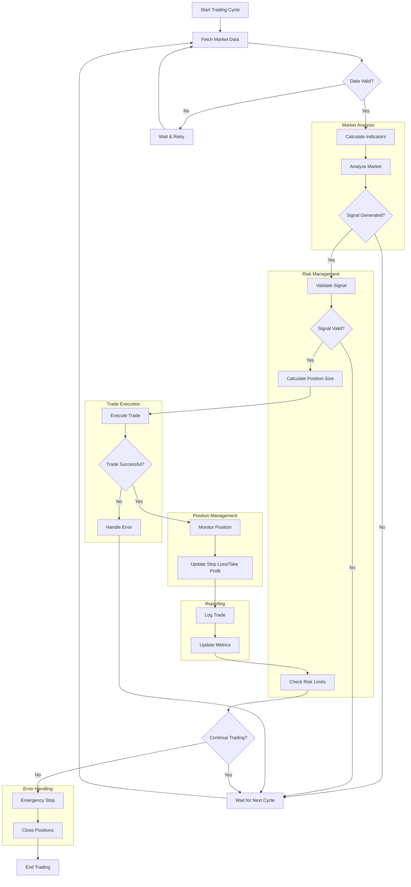

# Trading Bot Flowchart

## Component Details

### 1. Market Data Fetching
- Get latest price data from MT5
- Fetch volume and market depth
- Calculate technical indicators
- Validate data quality

### 2. Market Analysis
- Apply technical analysis
- Check multiple timeframes
- Confirm trading signals
- Filter false signals

### 3. Risk Management
- Position size calculation
- Risk per trade check
- Maximum drawdown monitoring
- Portfolio exposure control

### 4. Trade Execution
- Order preparation
- Slippage handling
- Execution confirmation
- Error handling

### 5. Position Management
- Stop loss monitoring
- Take profit adjustments
- Trailing stop updates
- Position scaling

### 6. Reporting & Monitoring
- Trade logging
- Performance metrics
- Account balance updates
- Risk metrics tracking

### 7. Error Handling
- API error recovery
- Connection management
- Emergency procedures
- System health monitoring

## Key Decision Points

1. **Data Validation**
   - Check for data gaps
   - Verify indicator values
   - Ensure market is open

2. **Signal Validation**
   - Confirm multiple indicators
   - Check timeframe alignment
   - Verify market conditions

3. **Risk Assessment**
   - Check position size limits
   - Verify account margin
   - Monitor risk exposure

4. **Trade Execution**
   - Check execution conditions
   - Verify order parameters
   - Monitor fill quality

5. **Position Monitoring**
   - Track profit/loss
   - Update stop levels
   - Monitor market conditions

## Error Handling

1. **Market Data Errors**
   - Retry on connection failure
   - Use cached data if needed
   - Log data quality issues

2. **Execution Errors**
   - Retry failed orders
   - Adjust parameters
   - Emergency stop if needed

3. **System Errors**
   - Maintain system health
   - Monitor resources
   - Handle crashes gracefully

## Performance Monitoring

1. **Trade Metrics**
   - Win/loss ratio
   - Average profit/loss
   - Maximum drawdown

2. **System Metrics**
   - CPU/Memory usage
   - Network latency
   - API response time

3. **Risk Metrics**
   - Position exposure
   - Account margin
   - Daily P&L
